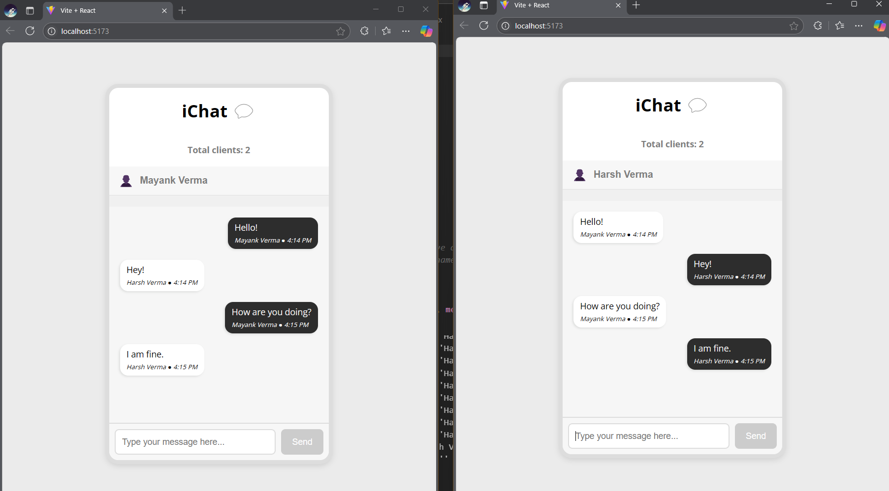

# React Real-Time Chat Application

A modern real-time chat application built using React, Socket.io, and Express.

## 🚀 Features

- **Real-time Messaging**: Instant message delivery with real-time broadcast to all connected users.
- **Multiple Users**: Supports multiple users chatting at the same time with dynamic client count.
- **Typing Indicators**: Displays when users are typing in the chat.
- **User Presence**: Shows the number of active users currently online.
- **Responsive Design**: Works on both desktop and mobile devices.
